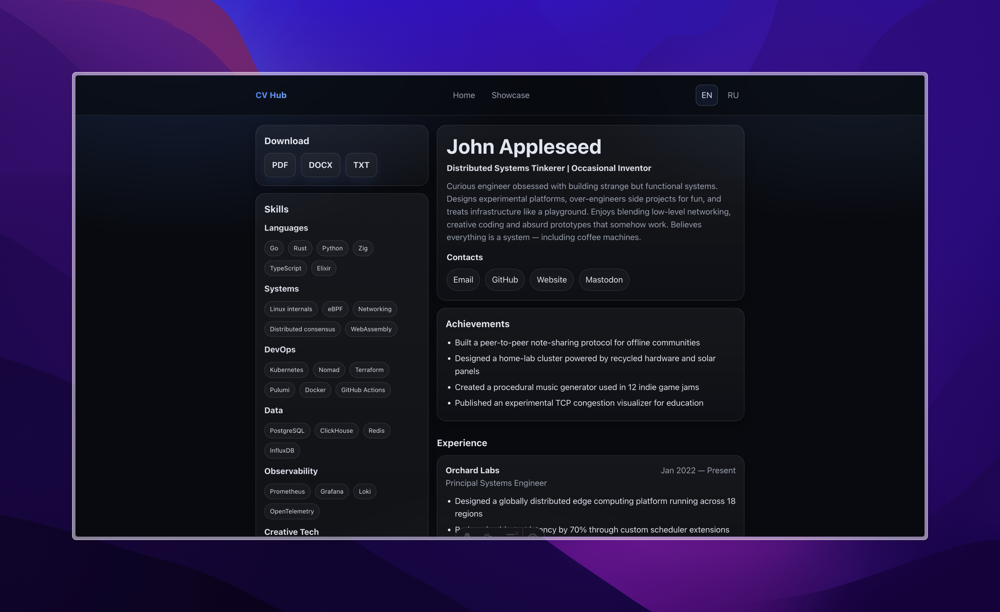

# CV Hub


[](https://keegooroomii.github.io/cv_hub/)
[](https://keegooroomii.github.io/cv_hub/)
[](https://keegooroomii.github.io/cv_hub/)
[](https://keegooroomii.github.io/cv_hub/)
[](https://github.com/KeeGooRoomiE/cv_hub/commits/main)
[](https://github.com/KeeGooRoomiE/cv_hub/stargazers)
[](https://hits.seeyoufarm.com)
[](https://github.com/KeeGooRoomiE/cv_hub/blob/main/CONTRIBUTING.md)

**Resume as Code. Reproducible. Versioned. Deployable.**

CV Hub turns your resume into infrastructure.

One YAML file becomes:

- A live personal website
- Downloadable PDF, DOCX and TXT files
- Multiple role-specific CV versions from a single source
- A structured, version-controlled professional profile
- A reproducible build artifact

No duplicated resumes. No platform lock-in. No visual builders.

Just data → build → deploy.

Treat your career like a system.

## Preview



🌐 **Live demo:** https://keegooroomii.github.io/cv_hub/

---

## Who is this for

CV Hub works for anyone who wants a professional website with full personal control:

- Developers, DevOps engineers, designers, managers, analysts — any specialist
- Anyone who wants multiple role-specific CV versions (DevOps, GameDev, Fullstack) from one source
- Anyone tired of Tilda, Notion, Canva, and other platforms
- Anyone who wants to version their resume with Git and automate format generation

> Minimum requirement — basic familiarity with the command line and Git. If you can clone a repo and edit text files, that's enough.

---

## What you get

- Main page — CV
- Showcase page — projects and case studies
- Changelog page — version history of your CV Hub
- Multi-language support — add as many languages as you need
- Multi-profile support — role-specific CV versions (DevOps, GameDev, Fullstack…) from one YAML source
- Downloadable resume files (PDF / DOCX / TXT) generated automatically per profile and language
- Clean static HTML deployed on GitHub Pages
- Full control over the visual style through a single CSS file with theme support
- URL-based theme switching for live previews

---

## Why this exists

Most people maintain:
- A PDF resume
- A LinkedIn profile
- A portfolio site
- A Notion page
- A DOCX file somewhere on their desktop

They all drift out of sync. And when you're applying to a DevOps role and a backend role at the same time, you maintain two separate copies of everything.

CV Hub eliminates duplication and centralizes everything into one structured source of truth.

Edit once. Define profiles. Regenerate everything. Commit changes. Deploy.

---

## Quick start

From zero to live site in under 5 minutes.

### 1. Fork the repository

Click **Fork** in the top right corner of the repository page on GitHub.

After forking you'll have your own copy: `github.com/YOUR_ACCOUNT/cv_hub`

### 2. Clone to your local machine

```bash
git clone https://github.com/YOUR_ACCOUNT/cv_hub.git
cd cv_hub
```

### 3. Install dependencies

```bash
npm install
npx playwright install chromium --with-deps
```

### 4. Run locally

```bash
npm run dev
```

The site will be available at `http://localhost:4321`

Pages:
- `/` — main CV page (default language)
- `/ru` — CV in Russian (or any other configured language)
- `/devops` — DevOps profile (if configured)
- `/devops/ru` — DevOps profile in Russian
- `/showcase` — projects showcase
- `/changelog` — version history

---

## How to edit your data

All data lives in `src/content/`:

```
src/content/
  cv/
    en.yaml            ← base CV in English
    ru.yaml            ← base CV in Russian
    en_devops.yaml     ← DevOps delta (optional)
    ru_devops.yaml     ← DevOps delta in Russian (optional)
  profiles/
    profiles.yml       ← profile registry (optional)
  languages/
    languages.yml      ← language config
  showcase/
    projects.yaml      ← projects list
  changelog/
    changelog.yaml     ← version history
  i18n/
    translations.yaml  ← UI strings
```

For full YAML structure reference — see **[`docs/INFO.md`](docs/INFO.md)**.

---

## Multi-profile system

CV Hub supports multiple role-specific CV versions generated from a single base YAML.

### How it works

1. `src/content/cv/en.yaml` — your full base CV
2. `src/content/cv/en_devops.yaml` — delta file with only the fields that change
3. `src/scripts/merge.mjs` merges them into `public/cv/en_devops.yaml`
4. The site generates `/devops` with the merged result

**Merge rules:**
- Scalar fields (`title`, `summary`): spec wins, missing fields fall back to base
- `skills`: entire block replaced if provided in spec
- `experience`: whitelist — only companies listed in spec appear; fields merged per entry by `company` key
- Other arrays (`achievements`, `contacts`, `education`): spec wins entirely if provided

### Profile configuration

```yaml
# src/content/profiles/profiles.yml
profiles:
  - id: default
    label: "Generalist"
    slug: ""
    spec: null
  - id: devops
    label: "DevOps"
    slug: "devops"
    spec: devops       # reads en_devops.yaml / ru_devops.yaml
  - id: gamedev
    label: "Game Developer"
    slug: "gamedev"
    spec: gamedev
```

`slug` is the URL segment. `spec` is the delta filename prefix.

### Delta file example

```yaml
# src/content/cv/en_devops.yaml — only what changes
title: DevOps / Platform Engineer | Kubernetes · Terraform · AWS

summary: >
  DevOps-focused summary here...

skills:
  - group: Orchestration
    items: [Kubernetes, Helm, Docker]
  - group: IaC
    items: [Terraform, Ansible]

experience:
  - company: InfoScale        # full entry from base, no override
  - company: AZNResearch
    role: Backend Engineer    # override role for this profile
    description:
      - Focused bullet points for DevOps context
```

Profiles without a `profiles.yml` work fine — the site falls back to a single default profile.

---

## Language configuration

Languages are configured in `src/content/languages/languages.yml`:

```yaml
default: "en"
languages:
  - id: "en"
    label: "EN"
  - id: "ru"
    label: "RU"
```

Add any language — create the corresponding `{lang}.yaml` base file in `src/content/cv/`, add UI strings to `translations.yaml`, and it will appear in the language switcher automatically.

---

## How to fill in your data

### Option A — Edit YAML directly

Open `src/content/cv/en.yaml` and fill in your data manually.
See [`docs/INFO.md`](docs/INFO.md) for the full field reference.

### Option B — Import from JSON Resume

```bash
npm run resume:import -- docs/cv_en.json en
npm run resume:import:all
```

### Option C — Generate from any resume via LLM

If you have a PDF, DOCX, or plain text resume — use Claude or ChatGPT with the ready-made prompt.

👉 **[See `docs/llm-resume-guide.md`](docs/llm-resume-guide.md)**

---

## How to customize the look

All styles live in `src/styles/global.css`.

The file is token-based — edit only the `:root` block to restyle the entire site:

```css
:root {
  --bg: #070a10;
  --accent: #3b82f6;
  --text: rgba(233, 238, 247, 0.96);
  --card-bg: linear-gradient(...);
  --r-lg: 18px;
}
```

### Themes

| File | Description |
|---|---|
| `frosted.css` | Dark glass, muted tones |
| `light.css` | Light background, dark text |
| `nordic.css` | Nord-inspired, cold blue-grey |
| `peachy.css` | Warm peach, light background |

To switch the default theme, change the import in `src/components/Layout.astro`:

```js
import '../styles/themes/nordic.css';
```

#### Live theme preview via URL

Any theme can be previewed live without changing code:

```
https://YOUR_ACCOUNT.github.io/cv_hub/?theme=peachy
```

Available values: `frosted`, `light`, `nordic`, `peachy`

Previews for all themes: **[`docs/repo-assets`](docs/repo-assets)**

---

## How to deploy to GitHub Pages

### 1. Enable GitHub Pages

`Settings → Pages → Source: GitHub Actions`

### 2. Push your changes

```bash
git add .
git commit -m "update cv data"
git push
```

Your site will be live at `https://YOUR_ACCOUNT.github.io/cv_hub/`

The deploy workflow runs automatically on every push to `main`. The `base` URL and `siteUrl` are resolved dynamically from `GITHUB_REPOSITORY` — forks work out of the box without any config changes.

---

## Resume file generation

All resume files are generated automatically during build:

```bash
npm run build
```

Build order:
1. `cv:build` — merge base + spec YAMLs into `public/cv/`
2. `resume:generate` — DOCX + TXT from merged YAMLs
3. `resume:pdf` — PDF via Playwright
4. `astro build` — static site

Output after build:

```
public/cv/
  en.yaml
  ru.yaml
  en_devops.yaml
  ru_devops.yaml
  en_gamedev.yaml
  ru_gamedev.yaml

public/downloads/
  resume_en.pdf / .docx / .txt
  resume_ru.pdf / .docx / .txt
  resume_en_devops.pdf / .docx / .txt
  resume_ru_devops.pdf / .docx / .txt
  resume_en_gamedev.pdf / .docx / .txt
  resume_ru_gamedev.pdf / .docx / .txt
```

---

## CLI reference

```bash
npm run dev                  # start local dev server
npm run build                # full build: merge → generate → pdf → astro
npm run cv:build             # merge base + spec YAMLs → public/cv/
npm run resume:generate      # generate DOCX + TXT for all profiles
npm run resume:pdf           # generate PDF for all profiles via Playwright
npm run resume:import        # convert JSON Resume → YAML (single file)
npm run resume:import:all    # convert both cv_en.json and cv_ru.json
npm run resume:linkedin      # parse LinkedIn PDF export → YAML (best-effort)
```

---

## Project structure

```
src/
  content/
    cv/
      en.yaml              # base CV in English
      ru.yaml              # base CV in Russian
      en_devops.yaml       # DevOps delta (spec)
      ru_devops.yaml
      en_gamedev.yaml      # GameDev delta (spec)
      ru_gamedev.yaml
    profiles/
      profiles.yml         # profile registry (optional)
    languages/
      languages.yml        # language config
    i18n/
      translations.yaml    # UI strings for all languages
    showcase/
      projects.yaml
    changelog/
      changelog.yaml
  pages/
    index.astro            # default profile + default lang
    [...slug].astro        # all other profile × lang combos
    showcase/
      index.astro
    changelog.astro
  components/
    Layout.astro           # shared layout: header, nav, footer
    HomePage.astro         # CV page blocks
    ProjectCard.astro      # project card with archive toggle
    AnimatedBackground.astro
  scripts/
    merge.mjs              # YAML merge pipeline
    t.ts                   # i18n helper
    resume-export-pdf.mjs  # PDF generator (Playwright)
    resume-import-json.mjs # JSON Resume → YAML converter
    resume-import-linkedin.mjs
  styles/
    global.css             # all styles + design tokens
    themes/                # color themes

public/
  cv/                      # merged YAML artifacts (generated)
  themes/                  # built theme files (auto-copied)
  downloads/               # generated resume files (after build)

.github/
  scripts/
    generate-resume.js     # DOCX + TXT generator
  workflows/
    deploy.yml             # CI/CD

docs/
  INFO.md
  ENGINEERING.md
  BKG_INFO.md
  llm-resume-guide.md
  examples/
  repo-assets/
```

---

## Tech stack

- [Astro](https://astro.build) — static site generator
- YAML — single source of truth
- [docx](https://docx.js.org) — DOCX generation
- [Playwright](https://playwright.dev) — PDF generation
- GitHub Pages — deployment
- GitHub Actions — CI/CD

---

## Documentation

| File | Description |
|---|---|
| [INFO.md](docs/INFO.md) | YAML field reference, data flow, i18n, profiles |
| [ENGINEERING.md](docs/ENGINEERING.md) | Architecture decisions, system design, trade-offs |
| [llm-resume-guide.md](docs/llm-resume-guide.md) | Generate YAML from any resume using an LLM |
| [BKG_INFO.md](docs/BKG_INFO.md) | AnimatedBackground component docs |

---

## License

Source code: MIT
Content (resume data): © Author